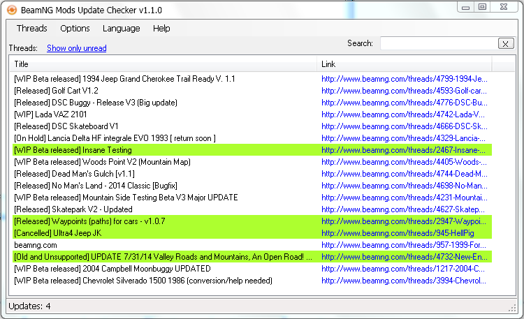

# Beamng-Mods-Update-Checker

This program checks the changes in the thread title and the changes in attachments (which are located in the first post of this thread). If any changes occurred - the program shows the notification and highlights the updated threads in a green color.

Just select in menu Threads => Add threads to add new threads in the list. Updates are checked every 120 minutes (interval can be changed in the options).
